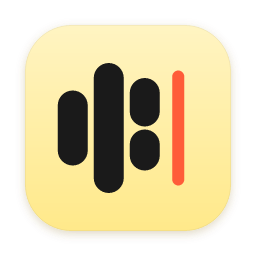

<p align="center">
  
</p>

<h1 align="center">Murmur</h1>

<p align="center">
  <i>If Wispr Flow had a face.</i>
</p>

<p align="center">
  Talk into any text field. Polish anything you've typed.<br/>
  Everything runs on your Mac. No account, no cloud, no network.
</p>

<p align="center">
  <a href="https://github.com/Solomon-mithra/murmur/releases/latest"><b>⬇ Download for Mac</b></a>
  &nbsp;·&nbsp; macOS 13+ · Apple Silicon · ~225 MB, models included
</p>

<p align="center">
  
</p>

---

## Two shortcuts, any app

| | Shortcut | What happens |
|---|---|---|
| 🎙 **Dictate** | **Hold ⌃ Control + ⇧ Shift** | Talk while holding. Let go, and your words are typed where your cursor is. |
| ✨ **Polish** | **Tap ⌃ Control + ⌥ Option** | Murmur selects the whole field, fixes grammar, makes it a touch more professional, and puts it back. |

They work in Slack, Mail, Notion, your browser and your editor, and they never steal focus.
If you press another key during the chord (⌃⇧Tab, ⌃⌥←, …), Murmur steps aside, so your existing shortcuts keep working.

## Meet the face

Murmur stays invisible until you call it. Then a little face appears just above your Dock, over every app, full-screen ones included. It breathes, blinks now and then, and lets you know what it's doing without ever getting in the way.

| | Face | What it's doing |
|---|---|---|
| Listening | `(•ᴗ•)` | Leans in. Three tiny bars, the same ones as the logo, rise with your voice. |
| Writing it down | `φ(••)` | Its eyes follow the line while the pen writes. |
| Polishing | `(˘ᴗ˘)` | Eyes softly closed, humming along. Little gleams catch the light. |
| Done | `(^‿^)` | A beat, then the eyes close into a smile. A check draws itself next to what it typed. |
| Didn't catch that | `(•_•)?` | A slow, puzzled head tilt. Never an alarm. |
| May I come in? | `(•ᴖ•)` | First launch: politely asks for keyboard access. |
| Waking up | `(–ω–)ᶻ` | Asleep for a second while the models load. |

Animations follow your system's *Reduce Motion* setting.

## Install

### Download the DMG

1. Download **`Murmur_0.1.0_aarch64.dmg`** from the [latest release](https://github.com/Solomon-mithra/murmur/releases/latest).
2. Open it and drag **Murmur** into **Applications**.
3. Open Murmur. The first time, right-click → **Open** (it isn't notarized yet).

### Or one line in Terminal

```sh
curl -fsSL https://raw.githubusercontent.com/Solomon-mithra/murmur/main/scripts/install.sh | bash
```

This downloads the latest DMG, installs it to `/Applications`, clears the download quarantine, and opens it.

### Two permissions, once

| Permission | Why Murmur needs it |
|---|---|
| **Microphone** | To hear you while you hold ⌃⇧. |
| **Accessibility** | To notice the shortcuts and to type for you (⌘V, ⌘A). Every app that types into other apps needs this, Wispr Flow included. |

Murmur opens the macOS prompt for you. Until you allow it, the face asks *"may I come in?"*. On macOS 27 the setting lives in **System Settings → Device Control and Data Access**.

## What runs on your Mac

Both models ship **inside the app**. There's nothing else to download, and Murmur works offline from the first launch.

| Job | Model | Size | Runs on |
|---|---|---|---|
| Speech → text | [**Cactus Whistle**](https://cactuscompute.com/blog/whistle) | 17 MB | CPU, via Cactus's Needle engine (`libneedle.a`), with the first word in ~20 ms |
| Polish | [**SmolLM2-135M-Instruct**](https://huggingface.co/HuggingFaceTB/SmolLM2-135M-Instruct) | 269 MB | CPU, in-process with [candle](https://github.com/huggingface/candle), ~0.5 s per sentence |

- **Private by construction.** Murmur contains no networking code, and the Whistle engine makes no network calls. Audio stays in memory and is never written to disk.
- **Your clipboard is put back** after every paste.
- **Small app.** Murmur is built on [Tauri 2](https://tauri.app) (Rust + the system WebView), with no Electron and no Swift. Nearly all of the download is the models.

## Dictation that understands how people talk

Speech is cleaned up with simple, predictable rules. There's no AI guessing at what you meant:

| You say | Murmur types |
|---|---|
| "Um, so we should meet at the the office." | So we should meet at the office. |
| "Let's refactor auth. Oh no, I meant let's continue with search." | Let's continue with search. |
| "Let's meet at three, no wait, four." | Let's meet at four. |
| "Send it to Bob. Scratch that. Send it to Alice." | Send it to Alice. |
| "Things to do bullet point fix login bullet point update docs" | Things to do<br/>- Fix login<br/>- Update docs |

Corrections: *no wait · I meant · oh no I meant · sorry I meant · actually no · or rather · scratch that*.
Structure: *bullet point · next bullet · new line · new paragraph*.

## How it works

```
 hold ⌃⇧ ─► mic ─► 16 kHz ─► voice gate ─► Whistle ─► cleanup rules ─► paste
 tap  ⌃⌥ ─► ⌘A ⌘C ─► SmolLM2, line by line ─► meaning guard ─► paste
```

- **Voice gate:** a clip needs at least 250 ms of sound clearly above the room's own noise. Whispers count; key clicks don't. Speech models like Whistle and Whisper tend to "hear" *"Thank you."* in a stray click.
- **Meaning guard:** a 135M model is small. If its rewrite drops more than a quarter of your words or invents more than 40% new ones, Murmur keeps your original text.
- **Overlay:** the widget is a non-activating `NSPanel` at pop-up-menu level, the only kind of window that can appear over another app's full-screen Space without taking focus.

```
src/                  the widget: HTML, CSS and one small TypeScript file
src-tauri/src/
  tap.rs              ⌃⇧ / ⌃⌥ chords (CGEventTap) + synthetic keystrokes
  audio.rs            mic capture, resampling, voice gate
  stt.rs              Whistle through libneedle.a (C FFI)
  cleanup.rs          fillers, stutters, self-corrections, spoken bullets
  llm.rs              SmolLM2 + meaning guard
  lib.rs              state machine, clipboard, overlay panel, menu bar
design/
  kaomoji.html        playground for the face; hold ⌃⇧ on the page
  banner.html         renders assets/banner.png from the real stylesheet
```

## Build from source

You'll need an Apple Silicon Mac with Rust, Node 20+ and Python 3.

```sh
git clone https://github.com/Solomon-mithra/murmur && cd murmur
npm install
./scripts/fetch-models.sh        # Whistle + Needle engine + SmolLM2 (~290 MB)
npm run tauri build              # → src-tauri/target/release/bundle/dmg/
```

Builds are ad-hoc signed, so macOS asks for Accessibility again after each rebuild. To keep the permission between builds, sign with your own certificate:

```sh
APPLE_SIGNING_IDENTITY="Apple Development: you@example.com (TEAMID)" npm run tauri build
```

Checks:

```sh
cd src-tauri
cargo test --lib                                       # chords, cleanup, voice gate, guard
cargo run --release --example dictate                  # cleanup on sample transcripts
cargo run --release --example rephrase -- "ur text"    # polish one string
cargo run --release --example transcribe -- clip.wav   # Whistle on a 16 kHz WAV
```

### Tuning

| Knob | Where | Default |
|---|---|---|
| Quietest sound that counts as voice | `audio.rs` `VOICE_FLOOR` | `0.0025` (≈ −52 dBFS) |
| How far above room noise speech must be | `audio.rs` `OVER_NOISE` | `2.5×` |
| How much rewriting the guard allows | `llm.rs` `sanitize` | lose ≤ 25 %, invent ≤ 40 % |
| Polish instructions | `llm.rs` `SYSTEM` | grammar + slightly professional |

## Limitations

- Apple Silicon Macs only; the Whistle engine is bundled for `macos-arm64`.
- English. Whistle knows 7 languages, but the cleanup rules and SmolLM2 are English-only.
- Dictation longer than 30 s is transcribed in 30 s windows, so a word can split at a seam.
- SmolLM2-135M is tiny. Polish handles grammar and tone well, but it can still swap a short word. ⌘Z brings your text back.
- Not notarized yet, so the first launch needs right-click → Open (or use the one-line installer).

## Credits

[Cactus Compute](https://cactuscompute.com) (Whistle + Needle engine, Apache-2.0) · [Hugging Face SmolLM2](https://huggingface.co/HuggingFaceTB/SmolLM2-135M-Instruct) (Apache-2.0) · [Tauri](https://tauri.app) · [candle](https://github.com/huggingface/candle) · [cpal](https://github.com/RustAudio/cpal)

Murmur is an independent project and isn't affiliated with Wispr Flow.
