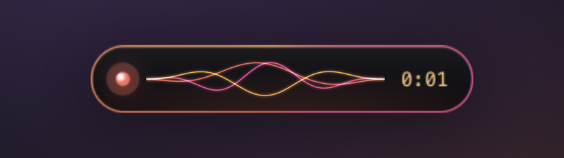
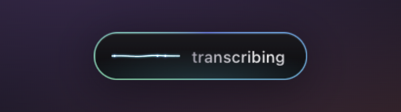
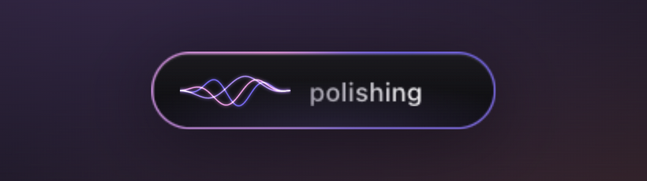

<p align="center">
  
</p>

<h1 align="center">Murmur</h1>

<p align="center">
  <b>Speak into any text field. Polish anything you've typed.</b><br/>
  On-device dictation and rewriting for macOS. No account, no cloud, no network.
</p>

<p align="center">
  
</p>

---

## Two shortcuts

| | Shortcut | What happens |
|---|---|---|
| 🎙 **Dictate** | **Hold ⌃ Control + ⇧ Shift** | Talk while holding. Let go, and the text is typed where your cursor is. |
| ✨ **Polish** | **Tap ⌃ Control + ⌥ Option** | Murmur selects the whole field, fixes grammar, makes it slightly more professional, and puts it back. |

Both work in any app: Slack, Mail, Notion, your browser, your editor. Neither steals focus.
If you press another key during the chord (⌃⇧Tab, ⌃⌥←, …), Murmur steps aside, so your existing shortcuts keep working.

## A widget that only shows up when called

Murmur stays invisible until you use it. It then blooms out of a seed, 10 px above your Dock, centred, above every window (full-screen apps included), and disappears when it's done.

<p align="center">
  
  <br/>
  
</p>

Each mode has its own light: **coral** while listening (three silk threads follow your voice), **cyan** while transcribing (beads race along a rail), **violet** while polishing (the threads braid), and **mint** when done (the check draws itself).

## Dictation that understands how people talk

Murmur cleans up speech with deterministic rules. It doesn't guess:

| You say | Murmur types |
|---|---|
| "Um, so we should meet at the the office." | So we should meet at the office. |
| "Let's refactor auth. Oh no, I meant let's continue with search." | Let's continue with search. |
| "Let's meet at three, no wait, four." | Let's meet at four. |
| "Send it to Bob. Scratch that. Send it to Alice." | Send it to Alice. |
| "Things to do bullet point fix login bullet point update docs" | Things to do<br/>- Fix login<br/>- Update docs |

Correction phrases: *no wait · I meant · oh no I meant · sorry I meant · actually no · or rather · scratch that*.
Structure phrases: *bullet point · next bullet · new line · new paragraph*.

## Install

### One line (Apple Silicon)

```sh
curl -fsSL https://raw.githubusercontent.com/Solomon-mithra/murmur/main/scripts/install.sh | bash
```

Downloads the latest release, installs it to `/Applications`, and opens it.

### Or the DMG

1. Download `Murmur_x.y.z_aarch64.dmg` from [Releases](https://github.com/Solomon-mithra/murmur/releases).
2. Drag **Murmur** into **Applications**.
3. Open it. The first time, right-click → **Open** (Murmur isn't notarized yet).

**The models are inside the app.** The DMG is about 225 MB because it carries both models, so there's nothing else to download and Murmur works offline from the first launch.

### Permissions (once)

| Permission | Why |
|---|---|
| **Microphone** | To hear you while you hold ⌃⇧. |
| **Accessibility** | To see the shortcuts and to paste (⌘V) / select (⌘A) in the app you're typing in. Every auto-typing app needs this, Wispr Flow included. |

Murmur opens the macOS prompt for you. On macOS 27 this setting lives in **System Settings → Device Control and Data Access**. Until it's granted, the widget shows *"Grant Murmur keyboard access"*.

## Private by design

- **Speech-to-text:** [Cactus Whistle](https://cactuscompute.com/blog/whistle), a 17 MB model running on the CPU (first token in ~20 ms).
- **Rewriting:** [SmolLM2-135M-Instruct](https://huggingface.co/HuggingFaceTB/SmolLM2-135M-Instruct), running in-process through [candle](https://github.com/huggingface/candle).
- **No network code.** Audio never leaves memory, nothing is written to disk, and your clipboard is restored after every paste.

## How it works

```
 ⌃⇧ held ──► mic (cpal) ──► 16 kHz ──► voice gate ──► Whistle ──► cleanup rules ──► paste
 ⌃⌥ tap  ──► ⌘A ⌘C ──► SmolLM2 (line by line) ──► meaning guard ──► paste
```

- **Voice gate:** clips with less than 250 ms of speech above the room's noise floor are dropped. Whistle, like Whisper, hallucinates *"Thank you."* on key clicks.
- **Meaning guard:** if the 135M model drops more than a quarter of your words or invents more than 40% new ones, your original text is kept. A small model can't be trusted to always behave, so it's only allowed to make small fixes.
- **Overlay:** the window is re-classed as a non-activating `NSPanel` at pop-up-menu level, which is the only way to appear over another app's full-screen Space without taking focus.

Built with [Tauri 2](https://tauri.app) (Rust + system WebView). No Electron, no Swift.

```
src/                 widget: HTML/CSS + one canvas, ~4 KB
src-tauri/src/
  tap.rs             global ⌃⇧ / ⌃⌥ chords (CGEventTap) + synthetic keys
  audio.rs           mic capture, resampling, voice gate
  stt.rs             Whistle via libneedle.a (C FFI)
  cleanup.rs         fillers, stutters, self-corrections, spoken bullets
  llm.rs             SmolLM2 + meaning guard
  lib.rs             state machine, clipboard, overlay panel, tray
```

## Build from source

Needs an Apple Silicon Mac, Rust, Node 20+, Python 3.

```sh
git clone https://github.com/Solomon-mithra/murmur && cd murmur
npm install
./scripts/fetch-models.sh                 # Whistle + Needle engine + SmolLM2 (~290 MB)
npm run tauri build                       # → src-tauri/target/release/bundle/dmg/
```

Builds are ad-hoc signed by default, so macOS asks for Accessibility again after every rebuild.
To keep the permission between builds, sign with your own certificate:

```sh
APPLE_SIGNING_IDENTITY="Apple Development: you@example.com (TEAMID)" npm run tauri build
```

Tests and quick checks:

```sh
cd src-tauri
cargo test --lib                                       # chords, cleanup, voice gate, guard
cargo run --release --example dictate                  # cleanup on sample transcripts
cargo run --release --example rephrase -- "ur text"    # polish one string
cargo run --release --example transcribe -- clip.wav   # Whistle on a 16 kHz WAV
```

### Tuning

| Knob | File | Default |
|---|---|---|
| Quietest sound that counts as voice | `audio.rs` `VOICE_FLOOR` | `0.0025` (≈ −52 dBFS) |
| How far above room noise speech must be | `audio.rs` `OVER_NOISE` | `2.5×` |
| How much rewriting the guard allows | `llm.rs` `sanitize` | lose ≤ 25 %, invent ≤ 40 % |
| Polish instructions | `llm.rs` `SYSTEM` | grammar + slightly professional |

## Limitations

- Apple Silicon macOS only (the Whistle engine is bundled for `macos-arm64`).
- English. Whistle knows 7 languages, but the cleanup rules and SmolLM2 are English-only.
- Dictation over 30 s is transcribed in 30 s windows, so a word can split at a seam.
- SmolLM2-135M is tiny: polish is good for grammar and tone, but it can still swap a short word (it once turned "cc the team" into "invite the team"). ⌘Z undoes it.

## Credits

[Cactus Compute](https://cactuscompute.com) (Whistle + Needle engine, Apache-2.0) · [Hugging Face SmolLM2](https://huggingface.co/HuggingFaceTB/SmolLM2-135M-Instruct) (Apache-2.0) · [Tauri](https://tauri.app) · [candle](https://github.com/huggingface/candle) · [cpal](https://github.com/RustAudio/cpal)
